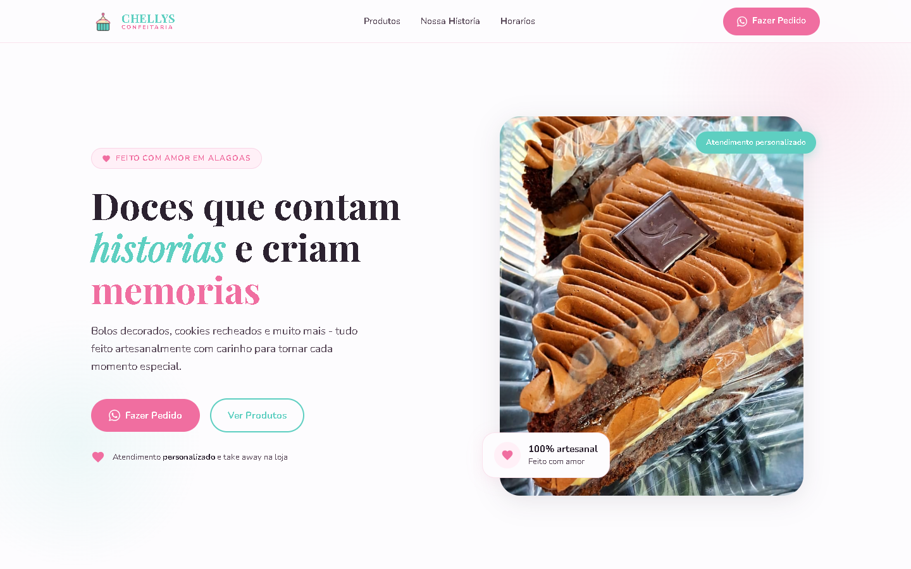

# 🧁 Chelly's Confeitaria — Landing Page

> Uma experiência digital doce, acolhedora e moderna para a confeitaria artesanal **Chelly's Confeitaria**, em Alagoas.

---

## 📸 Visão Geral do Projeto

Abaixo está a captura da tela principal (*Hero Section*) da landing page:

  

---

## 📖 Sobre o Projeto

### O que é?
A **Landing Page da Chelly's Confeitaria** é um site institucional e comercial de página única (*One-Page*), desenvolvido sob medida para apresentar os produtos, a essência e o carinho artesanal da confeitaria. A aplicação combina um design visual sofisticado com foco em experiência do usuário (UX/UI), alta performance e facilidade de contato.

### Objetivo
* **Fortalecer a Presença Digital:** Proporcionar uma identidade online profissional e intimista para a confeitaria física recém-estabelecida em Alagoas.
* **Apresentar o Cardápio de Delícias:** Exibir em alta resolução os bolos decorados de andares, fatias gourmet, brownies e cookies recheados com Nutella e cream cheese.
* **Humanizar a Marca (Storytelling):** Narrar a história real da fundadora — desde os primeiros bolos caseiros e especializações até a concretização do sonho da loja física.
* **Potencializar Vendas e Encomendas:** Conectar clientes diretamente ao canal de atendimento personalizado via **WhatsApp** e **Instagram**, estimulando encomendas e o modelo de retirada na loja (*take away*).

---

## 🚀 Tecnologias Utilizadas

O projeto foi construído priorizando performance, leveza e código limpo, sem dependência de bibliotecas pesadas:

| Tecnologia | Descrição e Aplicação |
| :--- | :--- |
| **HTML5 Semântico** | Marcação estruturada e acessível com tags semânticas (`<header>`, `<main>`, `<section>`, `<article>`, `<footer>`) e atributos ARIA para leitores de tela. |
| **CSS3 Moderno** | Estilização avançada com *CSS Custom Properties* (variáveis de design tokens), CSS Grid, Flexbox, efeitos de blur/translucidez (*glassmorphism*) e responsividade fluida via Media Queries. |
| **JavaScript Vanilla** | Interatividade limpa e nativa para o menu hamburguer mobile, efeito dinâmico de sombra da barra de navegação e animações suaves de entrada (*Scroll Reveal*) utilizando `IntersectionObserver`. |
| **Google Fonts** | Combinação tipográfica harmoniosa entre a elegância clássica da **Playfair Display** (títulos) e a legibilidade amigável da **Nunito** (textos de apoio). |
| **SVGs Inline** | Ícones vetoriais e logotipo personalizados renderizados em SVG direto no código para carregamento instantâneo e resolução cristalina em qualquer display. |

---

## ✨ Principais Funcionalidades

- [x] **Navegação Suave e Intuitiva:** Cabeçalho fixo com destaque ao rolar a página (*scrolled header*) e menu móvel adaptável.
- [x] **Hero Section de Alto Impacto:** Apresentação clara da proposta de valor, badges flutuantes (*100% artesanal*, *atendimento personalizado*) e CTAs rápidos.
- [x] **Cardápio Visual (Grid de Produtos):** Destaque para produtos campeões em layout de cartões modernos com fotos reais e descrições convidativas.
- [x] **Seção Nossa História:** Storytelling envolvente com galeria de fotos integradas e composição fotográfica elegante.
- [x] **Horários e Atendimento:** Informações práticas sobre dias e turnos de funcionamento para o formato *take away*.
- [x] **Integração Comercial Direta:** Botões otimizados de clique direto para WhatsApp com mensagem e perfil no Instagram.
- [x] **Design Totalmente Responsivo:** Layout rigorosamente adaptado para smartphones, tablets e telas desktop ultrawide.

---

## 🎨 Paleta de Cores e Estilo Visual

A identidade visual utiliza tons suaves e acolhedores inspirados em confeitarias artesanais:

- **Rosa Claro / Acento Principal:** `#F06EA0` — Calor, afeto e delicadeza.
- **Teal / Verde Menta Suave:** `#5ECFC1` — Frescor e equilíbrio artesanal.
- **Tinta / Tipografia Escura:** `#2C2230` — Contraste confortável e ótima legibilidade.
- **Fundo / Bege Claro Suave:** `#FDFCFE` — Sensação de clareza e limpeza.

## 👩‍🍳 Créditos e Licença

Desenvolvido com carinho para a **Chelly's Confeitaria** (Alagoas, Brasil). Todos os direitos dos produtos e marcas pertencem à Chelly's Confeitaria.
